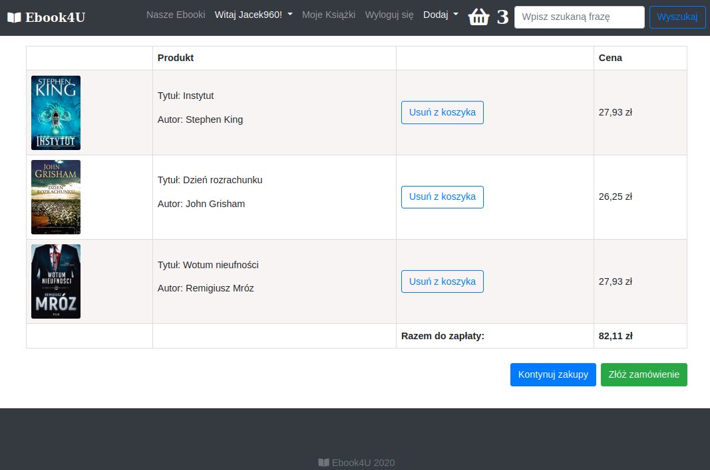

# Ebook shop 
> Website - ebook store

## Table of contents
* [General info](#general-info)
* [Screenshots](#screenshots)
* [Technologies](#technologies)
* [Setup](#setup)
* [Features](#features)
* [Status](#status)
* [Credits](#credits)
* [Contact](#contact)

## General info
Websites for selling ebooks

## Screenshots
Home Page

Dashbord

Book page

Basket

Order history

My Books

## Technologies
* Django 2.2.19
* Python 3.7
* Bootstrap 4

## Setup
Use pip installation to install dependencies from requirements.txt
## Code requirements.txt

`$ pip install -r requirements.txt`

## Features
To-do list:
* Payment options

## Status
Project is: _finished_

## Credits
Photos for project used from official book sites. Thank you all!

## Contact
Created by [Jacek960](mailto:j.kuciel@outlook.com)- feel free to contact me!

